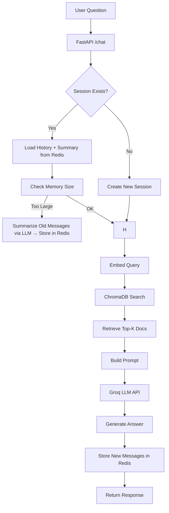

# Smart Travel AI Assistant - FastAPI Backend

**Production-ready AI travel assistant backend** built with **FastAPI**, using a **Retrieval-Augmented Generation (RAG)** pipeline, **session-based memory**, and **Groq-hosted LLMs**.

This system retrieves relevant travel data, maintains conversational context, and generates **grounded, low-hallucination responses**.

---

## 🛠 Features

* 🔍 **RAG Pipeline**

  * Semantic search over travel documents using embeddings
  * Top-K retrieval via ChromaDB

* 🧠 **Conversational Memory (Redis-backed)**

  * Short-term memory (recent turns)
  * Long-term memory (LLM-generated summaries)
  * Session persistence across restarts

* ⚡ **Groq LLM Integration (Free API)**

  * LLaMA3 / Mixtral support
  * Ultra-fast inference
  * Robust error handling (401, 403, 404, 429, 5xx)

* 🎯 **Strict Prompt Engineering**

  * Prevents hallucination
  * Forces grounded answers from retrieved context

* 🧩 **Modular Architecture**

  * LLM layer isolated
  * RAG pipeline independent
  * Easily swappable providers

* 🌐 **Frontend-ready API**

  * Session-based chat (`session_id`)
  * Clean JSON responses

---

## ⚙️ Tech Stack

| Layer           | Technology                                |
| --------------- | ----------------------------------------- |
| Backend         | Python 3.11+                              |
| Framework       | FastAPI                                   |
| Vector Database | ChromaDB                                  |
| Embeddings      | SentenceTransformers (`all-MiniLM-L6-v2`) |
| LLM Provider    | Groq API (LLaMA3 / Mixtral)               |
| Memory Store    | Redis                                     |
| Validation      | Pydantic                                  |
| Server          | Uvicorn                                   |

---

## 📂 Project Structure

```
app/
├─ main.py
├─ routes/
│  └─ chat.py
├─ utils/
│  ├─ embeddings.py
│  ├─ vector_db.py
│  └─ llm_helpers.py   # Groq API + prompt builder
├─ memory/
│  └─ chat_memory.py   # Redis session memory
├─ data/
│  └─ travel_docs.json
```

---

## 🔧 Installation

```bash
git clone https://github.com/salahinmushfiq/smart_travel_ai.git
cd smart_travel_ai

python -m venv venv
source venv/bin/activate   # Linux/Mac
venv\Scripts\activate      # Windows

pip install -r requirements.txt
uvicorn app.main:app --reload
```

Server runs at:

```
http://127.0.0.1:8000/
```

---

## 🔐 Environment Variables

Create a `.env` file:

```env
GROQ_API_KEY=your_api_key_here
GROQ_MODEL=llama3-8b-8192
```

---

## 📡 API

### POST `/chat/`

```json
{
  "question": "Tell me about hills in Bangladesh",
  "session_id": "optional",
  "top_k": 3
}
```

### Response

```json
{
  "status": "success",
  "session_id": "uuid",
  "answer": "...",
  "retrieved_docs": [...],
  "history_length": 4
}
```

---

## 🧠 Memory Architecture

### Short-Term Memory

* Last N turns stored in Redis
* Injected into prompt

### Long-Term Memory

* Older messages summarized using LLM
* Stored separately for token efficiency

### Why this matters

* Prevents prompt overflow
* Enables long conversations
* Keeps responses relevant

---

## 🔄 System Flow (FULL)



---

## 🧩 Architecture Principles

* 🔹 LLM layer is **stateless & replaceable**
* 🔹 RAG is **data-source independent**
* 🔹 Memory is **externalized (Redis)**
* 🔹 Services are **loosely coupled**

---

## 🚀 Future Roadmap

* 🔄 Django Tour API → RAG ingestion layer
* 🌍 Web search integration (Tavily / SerpAPI)
* ⏱ Background sync (Celery)
* ☁️ Free-tier deployment (Render / Fly.io)

---

## 📌 Current Status

* ✅ Groq API integration complete
* ✅ RAG pipeline stable
* ✅ Redis memory system active
* ✅ Chat sessions working
* 🚀 Ready for deployment phase

---

## ⚠️ Known Limitations

* Static dataset (`travel_docs.json`) used as primary knowledge source
* No real-time data sync with external APIs yet
* No web search augmentation (planned)

---

## 🧠 What This Project Demonstrates

* End-to-end RAG system design
* Real-world LLM integration (API-based)
* Memory-augmented conversational AI
* Scalable backend architecture
* Production-ready engineering patterns
