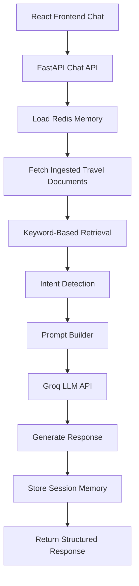
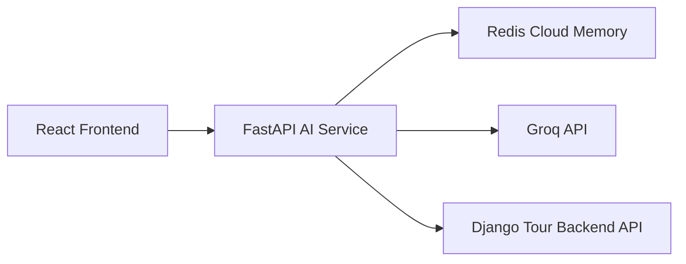

# Smart Travel AI Assistant — Deployment-Optimized AI Backend

Lightweight deployable AI travel assistant backend built with FastAPI, Redis memory, Groq-hosted LLMs, and a deployment-aware retrieval architecture.

This branch prioritizes:

* deployment stability
* free-tier compatibility
* low RAM usage
* infrastructure reliability
* demo readiness

while preserving the overall RAG-oriented architecture and conversational AI workflow.

---

# 🚀 Purpose of This Branch

This branch exists as:

* a stable deployment branch
* demo branch
* infrastructure-safe version
* free-tier compatible AI architecture
* frontend-integrated production snapshot

The semantic retrieval system from the `main` branch was strategically simplified to allow reliable deployment on constrained infrastructure such as:

* Render Free Tier
* low-memory containers
* hobby VPS environments

This version focuses on practical deployment engineering while preserving:

* conversational memory
* intent-aware orchestration
* retrieval pipelines
* modular AI architecture
* frontend integration contracts

---

# 🧠 Core Features

## 🔍 Lightweight Retrieval Layer

Instead of embedding-heavy vector search:

* keyword scoring retrieval
* lightweight ranking system
* in-memory retrieval
* deployment-safe document matching

Benefits:

* near-zero cold-start cost
* reduced RAM usage
* faster deployment startup
* infrastructure stability
* free-tier compatibility

---

## 🌐 Dynamic Data Ingestion Pipeline

The AI backend supports dynamic ingestion from a public Django API endpoint.

Features:

* fetches live tour data from external backend APIs
* transforms API responses into retrieval-ready documents
* ingestion abstraction layer
* decoupled AI + business backend architecture

This allows:

* centralized tour management in Django
* AI retrieval in FastAPI
* independent service scaling
* distributed microservice-style architecture

---

## 🧠 Redis Conversational Memory

Supports:

* session-based memory
* recent chat history
* summarized long-term memory
* persistent conversation continuity

---

## ⚡ Groq LLM Integration

Supports:

* LLaMA3
* Mixtral

Features:

* fast inference
* robust fallback handling
* provider abstraction
* low-latency responses

---

## 🎯 Intent-Aware Responses

Rule-based routing supports:

* itinerary generation
* recommendation formatting
* conversational assistance
* travel discovery mode
* contextual explanation responses

---

## 💬 Modern Frontend Chat Integration

Integrated React AI assistant popup includes:

* floating draggable AI chat window
* session persistence via localStorage
* expandable retrieval intelligence cards
* route visualization
* relevance scoring labels
* responsive mobile UI
* animated conversational interface
* source inspection support

Frontend architecture uses:

* React
* Framer Motion
* TailwindCSS
* Lucide Icons

---

# ⚙️ Tech Stack

| Layer        | Technology                    |
| ------------ | ----------------------------- |
| Backend      | FastAPI                       |
| Frontend     | React + Vite                  |
| AI Provider  | Groq                          |
| Memory Store | Redis                         |
| Retrieval    | Lightweight in-memory ranking |
| Validation   | Pydantic                      |
| Deployment   | Render                        |
| Web Server   | Gunicorn + Uvicorn            |
| UI           | TailwindCSS + Framer Motion   |

---

# 📂 Project Structure

```txt
app/
├── main.py
├── routes/
│   └── chat.py
├── services/
│   ├── data_ingestion.py
│   └── retrieval_service.py
├── memory/
│   └── chat_memory.py
├── utils/
│   ├── vector_db.py
│   ├── llm_helpers.py
│   ├── redis_client.py
│   ├── intent.py
│   ├── preferences.py
│   └── logger.py
```

```txt
src/
├── ai_agent/
│   └── AiAssistant.jsx
├── components/
│   └── AiChatPopup.jsx
```

---

# 🔄 Deployment-Oriented System Flow



---

# 🌐 Distributed Service Architecture



---

# 🔐 Environment Variables

```env
GROQ_API_KEY=your_key
GROQ_MODEL=llama3-8b-8192

REDIS_URL=redis://your_redis_url

DJANGO_API_URL=https://your-django-api.com/api/tours/public/

ALLOW_ORIGIN=https://your-frontend-url.com
```

---

# ▶️ Local Development

```bash
git clone https://github.com/salahinmushfiq/smart_travel_ai.git

cd smart_travel_ai

python -m venv venv

source venv/bin/activate
# or
venv\Scripts\activate

pip install -r requirements.txt

uvicorn app.main:app --reload
```

---

# 🚀 Production Deployment

## Render Start Command

```bash
gunicorn app.main:app \
-k uvicorn.workers.UvicornWorker \
--bind 0.0.0.0:$PORT
```

## Build Command

```bash
pip install -r requirements.txt
```

---

# 📡 API Example

## POST `/chat/`

```json
{
  "question": "Suggest beach tours in Bangladesh",
  "session_id": "optional",
  "top_k": 3
}
```

---

# 📦 Example Response

```json
{
  "status": "success",
  "session_id": "uuid",
  "answer": "...",
  "retrieved_docs": [],
  "history_length": 4,
  "intent": "list"
}
```

---

# 🧩 Why This Version Exists

The original semantic RAG implementation included:

* sentence-transformers
* torch
* embedding generation
* ChromaDB persistence

These caused:

* memory pressure
* cold-start instability
* deployment crashes on constrained infrastructure

This branch demonstrates:

* infrastructure-aware engineering
* graceful degradation
* deployment optimization
* frontend-backend AI integration
* architecture preservation under constraints

The retrieval implementation was simplified while preserving:

* modular design
* conversational flow
* memory orchestration
* prompt engineering
* API contracts
* frontend compatibility

---

# 🧠 Engineering Decisions

## Strategic Tradeoffs

Replaced:

* semantic embeddings
* vector databases

With:

* lightweight retrieval
* keyword ranking
* deployment-oriented orchestration

To achieve:

* reliable deployment
* lower infrastructure cost
* stable recruiter demos
* faster cold starts
* production-safe free-tier hosting

---

# 📌 Current Status

✅ FastAPI deployment live
✅ Redis cloud integration active
✅ Session memory operational
✅ Groq integration active
✅ Intent-aware prompting working
✅ Frontend integration completed
✅ Dynamic API ingestion working
✅ Mobile-responsive AI assistant deployed
🚀 Stable deployment achieved

---

# 🚀 Future Migration Path

This architecture allows future migration back to:

* semantic embeddings
* ChromaDB
* pgvector
* Pinecone
* hybrid retrieval
* semantic reranking

without major API rewrites.

---

# 🧠 What This Project Demonstrates

This branch demonstrates:

* practical AI engineering
* deployment-aware backend design
* distributed service integration
* conversational AI orchestration
* production tradeoff decisions
* scalable architecture planning
* real-world infrastructure adaptation
* frontend AI UX engineering
* deployable AI system architecture
