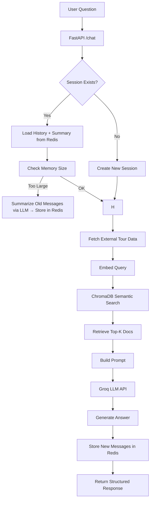
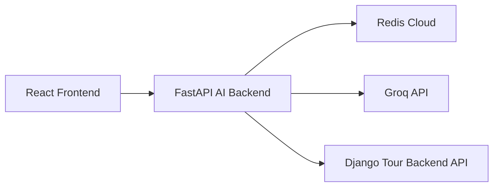
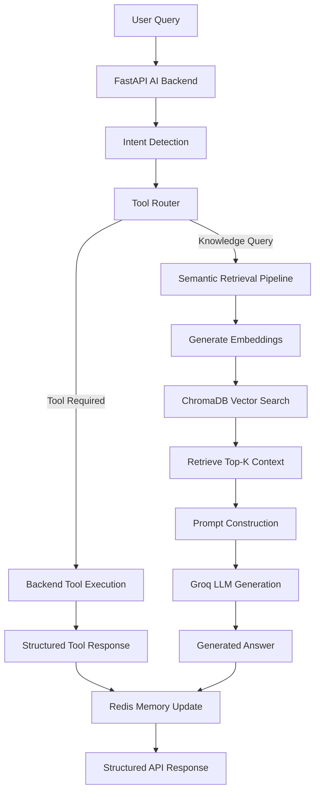
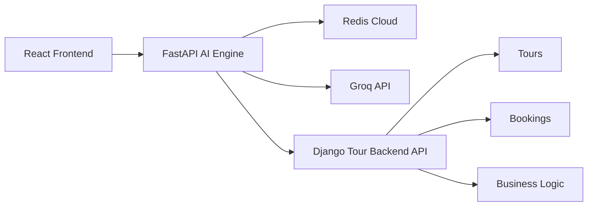

# Smart Travel AI Assistant — Full RAG AI Backend

Production-ready AI travel assistant backend built with FastAPI using a Retrieval-Augmented Generation (RAG) pipeline, semantic retrieval, Redis-backed conversational memory, and Groq-hosted LLMs.

This system retrieves relevant travel data, maintains conversational context, and generates grounded, context-aware travel responses.

---

# 🧠 Core Features

## 🔍 Full Semantic RAG Pipeline

Features:

* semantic document search
* embedding-based retrieval
* ChromaDB vector persistence
* top-k contextual retrieval
* similarity-based ranking

Uses:

* SentenceTransformers
* all-MiniLM-L6-v2 embeddings
* ChromaDB

---

## 🌐 Dynamic Tour Data Ingestion

Instead of relying only on static JSON files, the backend supports ingestion from a live Django API endpoint.

Capabilities:

* fetch live travel/tour data
* transform API responses into retrieval documents
* centralized business backend architecture
* independent AI service orchestration

This creates a distributed architecture where:

* Django manages business logic and tour data
* FastAPI manages AI orchestration and retrieval
* Redis manages conversational memory

---

## 🧠 Conversational Memory (Redis-backed)

Supports:

* short-term conversational memory
* long-term summarized memory
* session persistence
* memory-efficient prompt construction

---

## ⚡ Groq LLM Integration

Supports:

* LLaMA3
* Mixtral

Features:

* ultra-fast inference
* provider abstraction
* robust retry/error handling
* scalable LLM orchestration

---

## 🎯 Strict Prompt Engineering

Prompt system designed to:

* reduce hallucinations
* force grounded answers
* prioritize retrieved context
* maintain travel-focused responses

---

## 💬 Frontend AI Chat Integration

Integrated React AI assistant includes:

* animated floating AI chat popup
* session persistence
* retrieval intelligence inspection
* responsive mobile support
* route visualization cards
* relevance scoring UI
* conversational interface memory

---

# ⚙️ Tech Stack

| Layer           | Technology                  |
| --------------- | --------------------------- |
| Backend         | FastAPI                     |
| Frontend        | React + Vite                |
| Vector Database | ChromaDB                    |
| Embeddings      | SentenceTransformers        |
| LLM Provider    | Groq API                    |
| Memory Store    | Redis                       |
| Validation      | Pydantic                    |
| Server          | Uvicorn                     |
| UI              | TailwindCSS + Framer Motion |

---

# 📂 Project Structure

```txt
app/
├─ main.py
├─ routes/
│  └─ chat.py
├─ services/
│  └─ data_ingestion.py
├─ utils/
│  ├─ embeddings.py
│  ├─ vector_db.py
│  ├─ llm_helpers.py
│  ├─ intent.py
│  └─ logger.py
├─ memory/
│  └─ chat_memory.py
```

```txt
src/
├── ai_agent/
│   └── AiAssistant.jsx
├── components/
│   └── AiChatPopup.jsx
```

---

# 🔧 Installation

```bash
git clone https://github.com/salahinmushfiq/smart_travel_ai.git
cd smart_travel_ai

python -m venv venv
source venv/bin/activate   # Linux/Mac
venv\Scripts\activate      # Windows

pip install -r requirements.txt
uvicorn app.main:app --reload
```

Server runs at:

```txt
http://127.0.0.1:8000/
```

---

# 🔐 Environment Variables

Create a `.env` file:

```env
GROQ_API_KEY=your_api_key_here
GROQ_MODEL=llama3-8b-8192

REDIS_URL=redis://your_redis_url

DJANGO_API_URL=https://your-django-api.com/api/tours/public/
```

---

# 📡 API

## POST `/chat/`

```json
{
  "question": "Tell me about hills in Bangladesh",
  "session_id": "optional",
  "top_k": 3
}
```

---

# 📦 Example Response

```json
{
  "status": "success",
  "session_id": "uuid",
  "answer": "...",
  "retrieved_docs": [...],
  "history_length": 4,
  "intent": "conversation"
}
```

---

# 🧠 Memory Architecture

## Short-Term Memory

* Recent conversational turns stored in Redis
* Injected dynamically into prompts

## Long-Term Memory

* Older messages summarized using LLMs
* Stored separately for token efficiency

## Benefits

* prevents prompt overflow
* enables long-running sessions
* maintains contextual continuity
* improves response relevance

---

# 🔄 System Flow (FULL RAG)



---

# 🌐 Distributed Architecture



---

# 🧩 Architecture Principles

* LLM layer is stateless and replaceable
* RAG is data-source independent
* memory is externalized through Redis
* services are loosely coupled
* frontend and backend remain independently scalable

---

# 🚀 Future Roadmap

* hybrid semantic + keyword retrieval
* reranking pipelines
* pgvector migration
* Pinecone integration
* Tavily / SerpAPI web search
* Celery background ingestion
* personalized itinerary generation
* travel preference learning

---

# 📌 Current Status

✅ Groq API integration complete
✅ Semantic RAG pipeline operational
✅ Redis memory system active
✅ Dynamic API ingestion working
✅ Chat sessions functioning
✅ Frontend AI assistant integrated
✅ Retrieval intelligence UI deployed
🚀 Production-ready architecture established

---

# ⚠️ Known Limitations

* free-tier infrastructure may struggle with embedding-heavy deployments
* semantic retrieval increases RAM usage
* no real-time external search augmentation yet
* ingestion currently depends on public backend endpoints

---

# 🧠 What This Project Demonstrates

This project demonstrates:

* end-to-end RAG system engineering
* semantic retrieval architecture
* production AI orchestration
* conversational memory systems
* distributed backend integration
* frontend AI UX engineering
* scalable AI service architecture
* deployment-aware system design
* real-world LLM integration
* modular AI backend engineering this was the existing one for context. updated to this: # Smart Travel AI Assistant

Production-oriented AI travel assistant backend built with FastAPI using Retrieval-Augmented Generation (RAG), semantic search, conversational memory, and modular AI orchestration.

The system combines:

* semantic retrieval
* conversational memory
* intent-aware response generation
* structured backend tooling
* scalable service orchestration

This architecture is designed for modern AI-powered SaaS systems where LLMs interact with external services, business APIs, and persistent memory layers.

---

# 🧠 Core Capabilities

## 🔍 Semantic Retrieval Pipeline

Features:

* semantic document retrieval
* embedding-based search
* vector persistence with ChromaDB
* top-k contextual retrieval
* similarity-based ranking
* retrieval score inspection

Uses:

* SentenceTransformers
* all-MiniLM-L6-v2 embeddings
* ChromaDB

The retrieval layer enables grounded, context-aware responses while reducing hallucinations.

---

## ⚡ AI Orchestration Layer

The backend includes a modular orchestration layer capable of routing requests between:

* retrieval pipelines
* conversational generation
* structured backend tools

Current orchestration capabilities:

* deterministic tool routing
* intent-aware response formatting
* structured backend execution
* tool metadata responses
* conversational context injection

This architecture separates:

```txt
Reasoning
Retrieval
Action Execution
Memory
Business Logic
```

into independently scalable layers.

---

## 🛠 Structured Tooling System

The system now supports backend tool execution.

Implemented tools:

* list available tours
* fetch detailed tour information
* create bookings
* cancel bookings

Current architecture:

```txt
User Query
   ↓
Tool Router
   ↓
RAG or Tool Execution
   ↓
Structured Response
```

Benefits:

* deterministic execution
* safer backend operations
* scalable orchestration
* SaaS-ready architecture
* extensible AI workflows

---

## 🌐 Dynamic Tour Data Ingestion

The AI backend ingests travel data from a live Django API.

Capabilities:

* fetch live travel/tour data
* transform API responses into retrieval documents
* centralized business backend architecture
* independent AI service orchestration

Distributed responsibilities:

| Service            | Responsibility                            |
| ------------------ | ----------------------------------------- |
| Django Backend     | Business logic + tour management          |
| FastAPI AI Backend | Retrieval + orchestration + AI generation |
| Redis              | Conversational memory                     |
| Groq API           | LLM inference                             |

---

## 🧠 Conversational Memory System

Redis-backed memory architecture supports:

* short-term conversational memory
* long-term summarized memory
* session persistence
* contextual continuity
* structured session metadata

Additional capabilities:

* memory summarization
* prompt token optimization
* preference persistence
* session-aware prompting

---

## 🎯 Intent-Aware Prompting

The backend includes lightweight intent detection.

Supported intents:

* itinerary
* list
* explain
* default

Benefits:

* controlled response formatting
* better conversational UX
* predictable AI output structure
* modular orchestration behavior

---

## ⚡ Groq LLM Integration

Supports:

* LLaMA3
* Mixtral

Features:

* ultra-fast inference
* provider abstraction
* retry/error handling
* scalable LLM integration

---

## 💬 Frontend AI Integration

Integrated React AI assistant includes:

* animated floating AI popup
* conversational chat interface
* retrieval intelligence inspection
* session persistence
* responsive mobile support
* relevance score visualization
* retrieval transparency UI

Frontend stack:

* React
* Vite
* TailwindCSS
* Framer Motion

---

# ⚙️ Tech Stack

| Layer           | Technology                  |
| --------------- | --------------------------- |
| Backend         | FastAPI                     |
| Frontend        | React + Vite                |
| Vector Database | ChromaDB                    |
| Embeddings      | SentenceTransformers        |
| LLM Provider    | Groq API                    |
| Memory Store    | Redis                       |
| Validation      | Pydantic                    |
| AI Routing      | Custom Tool Router          |
| API Server      | Uvicorn                     |
| UI              | TailwindCSS + Framer Motion |

---

# 🧩 High-Level Architecture



---

# 🌐 Distributed System Architecture



---

# 📂 Project Structure

```txt
app/
├─ main.py
├─ routes/
│  └─ chat.py
├─ services/
│  └─ data_ingestion.py
├─ memory/
│  └─ chat_memory.py
├─ tools/
│  ├─ booking_tools.py
│  ├─ tour_tools.py
│  ├─ registry.py
│  └─ tool_router.py
├─ utils/
│  ├─ embeddings.py
│  ├─ vector_db.py
│  ├─ llm_helpers.py
│  ├─ intent.py
│  ├─ preferences.py
│  ├─ redis_client.py
│  └─ logger.py
```

```txt
src/
├── ai_agent/
│   └── AiAssistant.jsx
├── components/
│   └── AiChatPopup.jsx
```

---

# 🔧 Installation

```bash
git clone https://github.com/salahinmushfiq/smart_travel_ai.git
cd smart_travel_ai

python -m venv venv

# Linux / Mac
source venv/bin/activate

# Windows
venv\Scripts\activate

pip install -r requirements.txt

uvicorn app.main:app --reload
```

Server runs at:

```txt
http://127.0.0.1:8000/
```

---

# 🔐 Environment Variables

Create a `.env` file:

```env
GROQ_API_KEY=your_api_key_here
GROQ_MODEL=llama3-8b-8192

REDIS_URL=redis://your_redis_url

DJANGO_API_URL=https://your-django-api.com/api/tours/public/
```

---

# 📡 API

## POST `/chat/`

```json
{
  "question": "Tell me about hill tours in Bangladesh",
  "session_id": "optional",
  "top_k": 3
}
```

---

# 📦 Example Response — Retrieval

```json
{
  "status": "success",
  "session_id": "uuid",
  "answer": "...",
  "retrieved_docs": [...],
  "history_length": 4,
  "intent": "list"
}
```

---

# 📦 Example Response — Tool Execution

```json
{
  "status": "success",
  "session_id": "uuid",
  "answer": {
    "status": "success",
    "message": "Booking created"
  },
  "tool_used": "create_booking",
  "tool_result": {
    "status": "success"
  }
}
```

---

# 🧠 Memory Architecture

## Short-Term Memory

* recent conversational turns stored in Redis
* dynamically injected into prompts

---

## Long-Term Memory

* older conversations summarized using LLMs
* token-efficient contextual continuity

---

## Structured Session Memory

Supports:

* user preferences
* travel interests
* future personalization support
* session-aware orchestration

---

# ✅ Recent Architectural Improvements

## AI Orchestration

Added:

* modular tool router
* structured tool registry
* deterministic tool execution
* intent-aware orchestration

---

## Retrieval System

Improved:

* scored retrieval responses
* cleaner context filtering
* modular vector search handling

---

## Memory System

Enhanced:

* Redis session metadata
* conversational summarization
* contextual preference persistence

---

## Backend Structure

Refactored:

* modular tools directory
* cleaner orchestration flow
* scalable backend separation
* production-oriented architecture

---

# 🧩 Architecture Principles

* modular AI orchestration
* scalable service separation
* retrieval-grounded generation
* externalized memory systems
* deterministic backend execution
* independently scalable frontend/backend
* deployment-aware architecture

---

# 📌 Current Status

✅ Semantic retrieval operational
✅ ChromaDB vector persistence active
✅ Redis conversational memory active
✅ Dynamic API ingestion working
✅ Tool routing layer implemented
✅ Structured backend tooling operational
✅ Intent-aware prompting active
✅ Frontend AI assistant integrated
✅ Retrieval intelligence UI deployed
✅ Production-oriented architecture established

---

# ⚠️ Known Limitations

* current tool routing is rule-based
* booking tools are placeholder implementations
* semantic retrieval increases RAM usage
* no real-time external search augmentation yet
* ingestion currently depends on public backend APIs

---

# 🧠 What This Project Demonstrates

This project demonstrates:

* production-oriented RAG architecture
* semantic retrieval engineering
* conversational memory systems
* AI orchestration architecture
* structured backend tooling
* distributed backend integration
* scalable AI system design
* frontend AI UX engineering
* deployment-aware backend engineering
* modular AI infrastructure design
* real-world LLM integration
* service-oriented AI architecture
